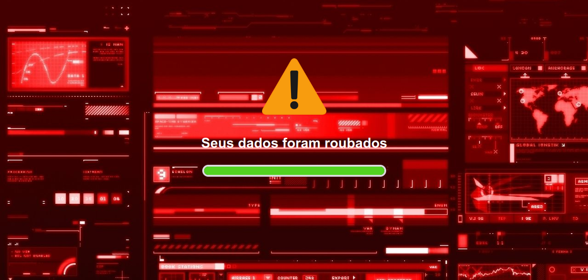
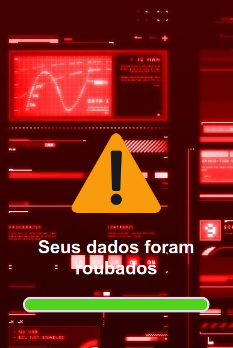

<h1 align="center"> projeto-seguranca </h1>

  <a href="#-tecnologias">Tecnologias</a>&nbsp;&nbsp;&nbsp;|&nbsp;&nbsp;&nbsp;
  <a href="#-projeto">Projeto</a>&nbsp;&nbsp;&nbsp;|&nbsp;&nbsp;&nbsp;
  <a href="#memo-licença">Licença</a>

  

 

<h1>Desktop:</h1>
  

<h1>Mobile:</h1>
 

## 🚀 Tecnologias

Esse projeto foi desenvolvido com as seguintes tecnologias:

- HTML
- CSS
- JavaScript

## 💻 Projeto

O projeto foi desenvolvido com o intuito de demostrar para os alunos que irão participar de uma palestra sobre noções de segurança da informação no Instituto Federal de Sergipe - Campus Propriá como hackers utilizam de links maliciosos para roubar dados pessoais de varios usuarios. Para demostrar essa situação de roubo de dados, foi criado um site que quando os alunos acessarem atráves do link receberam uma mensagem de que os dados foram roubados.

## Desenvolvido pelos alunos:
 Marcelo Henrique Dória Figueiredo
 * Linkedin: https://www.linkedin.com/in/marcelo-henrique-d%C3%B3ria-figueiredo-018518187/
 * GitHub: https://github.com/MarceloHenriqueDoriaFigueiredo
 
 Marcos da Silva Gomes
 * Liinkedin: https://www.linkedin.com/in/marcos-da-silva-gomes-86439a22b/
 * Github: https://github.com/marcosdevg

## :memo: Licença

Esse projeto está sob a licença MIT.

---
